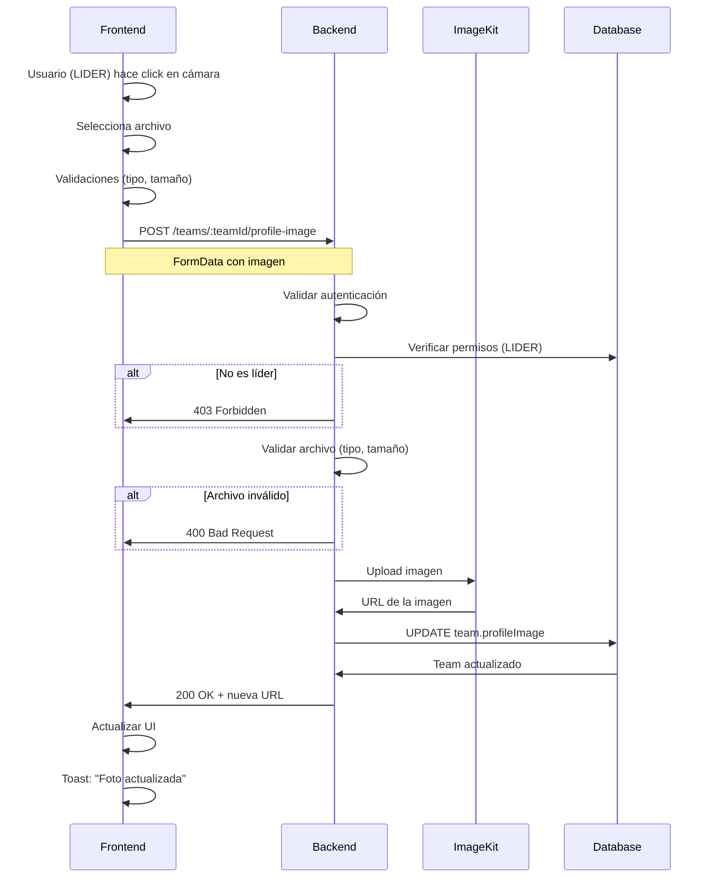

# 📸 Backend: Endpoint para Subir Foto de Perfil del Equipo

**Fecha:** 11 de Octubre, 2025  
**Prioridad:** 🔴 ALTA  
**Status:** ⏳ Pendiente de implementación

---

## 🎯 Objetivo

Implementar el endpoint que permita a los **líderes de equipo** subir y actualizar la foto de perfil de su equipo.

---

## 📋 Especificación del Endpoint

### Método: POST

```
POST /teams/:teamId/profile-image
```

### Headers

```http
Content-Type: multipart/form-data
Authorization: Bearer <JWT_TOKEN>
```

### Parámetros de Ruta

| Parámetro | Tipo | Descripción |
|-----------|------|-------------|
| `teamId` | string (UUID) | ID del equipo al que se subirá la foto |

### Body (multipart/form-data)

| Campo | Tipo | Requerido | Descripción |
|-------|------|-----------|-------------|
| `image` o `file` | File | ✅ Sí | Archivo de imagen (JPG, PNG, WebP) |

⚠️ **IMPORTANTE:** El frontend está enviando el campo como `'image'`. Verificar que el backend lo reciba con ese nombre.

---

## 🔐 Validaciones Requeridas

### 1. Autenticación

```javascript
// Verificar que el usuario esté autenticado
if (!req.user) {
  return res.status(401).json({
    error: { message: "No autenticado" }
  });
}
```

### 2. Permisos (CRÍTICO)

```javascript
// Verificar que el usuario sea LIDER del equipo
const member = await prisma.teamMember.findFirst({
  where: {
    teamId: req.params.teamId,
    userId: req.user.id,
    role: 'LIDER'
  }
});

if (!member) {
  return res.status(403).json({
    error: { message: "Solo los líderes pueden cambiar la foto del equipo" }
  });
}
```

⚠️ **MUY IMPORTANTE:** No confiar solo en el frontend. Validar permisos en el backend.

### 3. Validación del Archivo

```javascript
// Validar que se haya enviado un archivo
if (!req.file) {
  return res.status(400).json({
    error: { message: "No se ha proporcionado ninguna imagen" }
  });
}

// Validar tipo de archivo
const allowedTypes = ['image/jpeg', 'image/png', 'image/webp'];
if (!allowedTypes.includes(req.file.mimetype)) {
  return res.status(400).json({
    error: { message: "Solo se permiten imágenes JPG, PNG o WebP" }
  });
}

// Validar tamaño (máx 5MB)
const maxSize = 5 * 1024 * 1024; // 5MB
if (req.file.size > maxSize) {
  return res.status(400).json({
    error: { message: "La imagen no debe superar 5MB" }
  });
}
```

### 4. Validación del Equipo

```javascript
// Verificar que el equipo exista
const team = await prisma.team.findUnique({
  where: { id: req.params.teamId }
});

if (!team) {
  return res.status(404).json({
    error: { message: "Equipo no encontrado" }
  });
}
```

---

## 📤 Flujo de Procesamiento

### Paso 1: Validaciones

1. ✅ Usuario autenticado
2. ✅ Usuario es LIDER del equipo
3. ✅ Archivo enviado
4. ✅ Tipo de archivo válido (JPG/PNG/WebP)
5. ✅ Tamaño válido (≤ 5MB)
6. ✅ Equipo existe

### Paso 2: Upload a ImageKit (o servicio de storage)

```javascript
// Opción A: Upload a ImageKit
const uploadResult = await imagekit.upload({
  file: req.file.buffer, // o req.file.path si usas diskStorage
  fileName: `team-${team.id}-${Date.now()}.${ext}`,
  folder: '/teams/profile-images',
  useUniqueFileName: true,
  tags: ['team-profile', team.id]
});

const imageUrl = uploadResult.url;
```

```javascript
// Opción B: Upload a AWS S3
const s3Params = {
  Bucket: process.env.AWS_BUCKET_NAME,
  Key: `teams/${team.id}/profile-${Date.now()}.${ext}`,
  Body: req.file.buffer,
  ContentType: req.file.mimetype,
  ACL: 'public-read'
};

const uploadResult = await s3.upload(s3Params).promise();
const imageUrl = uploadResult.Location;
```

### Paso 3: Actualizar Base de Datos

```javascript
// Actualizar el profileImage del equipo
const updatedTeam = await prisma.team.update({
  where: { id: req.params.teamId },
  data: {
    profileImage: imageUrl
  }
});
```

### Paso 4: Respuesta Exitosa

```javascript
return res.status(200).json({
  success: true,
  message: "Foto de perfil actualizada correctamente",
  profileImage: imageUrl,
  team: {
    id: updatedTeam.id,
    name: updatedTeam.name,
    profileImage: updatedTeam.profileImage
  }
});
```

---

## 💻 Código de Ejemplo (Express.js + Multer)

### Configuración de Multer

```javascript
const multer = require('multer');

// Configurar Multer para almacenar en memoria
const storage = multer.memoryStorage();

const upload = multer({
  storage: storage,
  limits: {
    fileSize: 5 * 1024 * 1024 // 5MB
  },
  fileFilter: (req, file, cb) => {
    const allowedTypes = ['image/jpeg', 'image/png', 'image/webp'];
    if (allowedTypes.includes(file.mimetype)) {
      cb(null, true);
    } else {
      cb(new Error('Solo se permiten imágenes JPG, PNG o WebP'));
    }
  }
});
```

### Ruta Completa

```javascript
const express = require('express');
const router = express.Router();
const { PrismaClient } = require('@prisma/client');
const ImageKit = require('imagekit');

const prisma = new PrismaClient();

// Configurar ImageKit
const imagekit = new ImageKit({
  publicKey: process.env.IMAGEKIT_PUBLIC_KEY,
  privateKey: process.env.IMAGEKIT_PRIVATE_KEY,
  urlEndpoint: process.env.IMAGEKIT_URL_ENDPOINT
});

// Middleware de autenticación (ejemplo)
const authenticate = async (req, res, next) => {
  try {
    const token = req.headers.authorization?.replace('Bearer ', '');
    if (!token) {
      return res.status(401).json({ error: { message: 'No autenticado' } });
    }
    
    // Verificar token y obtener usuario
    const user = await verifyToken(token); // Tu función de verificación
    req.user = user;
    next();
  } catch (error) {
    res.status(401).json({ error: { message: 'Token inválido' } });
  }
};

/**
 * POST /teams/:teamId/profile-image
 * Subir foto de perfil del equipo (solo líderes)
 */
router.post(
  '/teams/:teamId/profile-image',
  authenticate,
  upload.single('image'), // ← Campo 'image' del FormData
  async (req, res) => {
    try {
      const { teamId } = req.params;
      const userId = req.user.id;

      // 1. Verificar que el archivo fue enviado
      if (!req.file) {
        return res.status(400).json({
          error: { message: 'No se ha proporcionado ninguna imagen' }
        });
      }

      // 2. Verificar que el equipo existe
      const team = await prisma.team.findUnique({
        where: { id: teamId }
      });

      if (!team) {
        return res.status(404).json({
          error: { message: 'Equipo no encontrado' }
        });
      }

      // 3. Verificar que el usuario es LIDER del equipo
      const member = await prisma.teamMember.findFirst({
        where: {
          teamId,
          userId,
          role: 'LIDER'
        }
      });

      if (!member) {
        return res.status(403).json({
          error: { message: 'Solo los líderes pueden cambiar la foto del equipo' }
        });
      }

      // 4. Subir imagen a ImageKit
      const ext = req.file.mimetype.split('/')[1];
      const fileName = `team-${teamId}-${Date.now()}.${ext}`;

      const uploadResult = await imagekit.upload({
        file: req.file.buffer.toString('base64'),
        fileName: fileName,
        folder: '/teams/profile-images',
        useUniqueFileName: true,
        tags: ['team-profile', teamId]
      });

      // 5. Actualizar base de datos
      const updatedTeam = await prisma.team.update({
        where: { id: teamId },
        data: {
          profileImage: uploadResult.url
        }
      });

      // 6. Responder con éxito
      res.status(200).json({
        success: true,
        message: 'Foto de perfil actualizada correctamente',
        profileImage: uploadResult.url,
        team: {
          id: updatedTeam.id,
          name: updatedTeam.name,
          profileImage: updatedTeam.profileImage
        }
      });

    } catch (error) {
      console.error('Error uploading team profile image:', error);
      
      // Manejar errores específicos de Multer
      if (error instanceof multer.MulterError) {
        if (error.code === 'LIMIT_FILE_SIZE') {
          return res.status(400).json({
            error: { message: 'La imagen no debe superar 5MB' }
          });
        }
      }

      res.status(500).json({
        error: { message: 'Error al subir la imagen' }
      });
    }
  }
);

module.exports = router;
```

---

## 📦 Dependencias Necesarias

### NPM Packages

```bash
npm install multer imagekit
```

```json
{
  "dependencies": {
    "multer": "^1.4.5-lts.1",
    "imagekit": "^5.0.0"
  }
}
```

### Variables de Entorno

Agregar a `.env`:

```bash
# ImageKit Configuration
IMAGEKIT_PUBLIC_KEY=your_public_key_here
IMAGEKIT_PRIVATE_KEY=your_private_key_here
IMAGEKIT_URL_ENDPOINT=https://ik.imagekit.io/your_id
```

---

## 🔄 Respuestas del Endpoint

### ✅ Éxito (200 OK)

```json
{
  "success": true,
  "message": "Foto de perfil actualizada correctamente",
  "profileImage": "https://ik.imagekit.io/cresia/teams/profile-images/team-abc123-1697040000000.jpg",
  "team": {
    "id": "abc123",
    "name": "DevTeam Pro",
    "profileImage": "https://ik.imagekit.io/cresia/teams/profile-images/team-abc123-1697040000000.jpg"
  }
}
```

### ❌ Error: No Autenticado (401)

```json
{
  "error": {
    "message": "No autenticado"
  }
}
```

### ❌ Error: Sin Permisos (403)

```json
{
  "error": {
    "message": "Solo los líderes pueden cambiar la foto del equipo"
  }
}
```

### ❌ Error: Equipo No Encontrado (404)

```json
{
  "error": {
    "message": "Equipo no encontrado"
  }
}
```

### ❌ Error: Archivo No Válido (400)

```json
{
  "error": {
    "message": "Solo se permiten imágenes JPG, PNG o WebP"
  }
}
```

### ❌ Error: Archivo Muy Grande (400)

```json
{
  "error": {
    "message": "La imagen no debe superar 5MB"
  }
}
```

### ❌ Error: Sin Archivo (400)

```json
{
  "error": {
    "message": "No se ha proporcionado ninguna imagen"
  }
}
```

---

## 🗄️ Modelo de Base de Datos (Prisma)

### Schema Actual

Verificar que el modelo `Team` tenga el campo `profileImage`:

```prisma
model Team {
  id           String   @id @default(uuid())
  name         String
  description  String?
  profileImage String?  // ← Este campo debe existir
  city         String?
  country      String?
  website      String?
  email        String?
  phone        String?
  verified     Boolean  @default(false)
  createdAt    DateTime @default(now())
  updatedAt    DateTime @updatedAt

  members      TeamMember[]
  
  @@map("teams")
}
```

### Si el campo NO existe, crear migración:

```bash
npx prisma migrate dev --name add_team_profile_image
```

```sql
-- Migration SQL
ALTER TABLE "teams" ADD COLUMN "profileImage" TEXT;
```

---

## 🧪 Testing del Endpoint

### Usando cURL

```bash
curl -X POST \
  http://localhost:4000/teams/abc123/profile-image \
  -H "Authorization: Bearer YOUR_JWT_TOKEN" \
  -F "image=@/path/to/photo.jpg"
```

### Usando Postman

1. **Method:** POST
2. **URL:** `http://localhost:4000/teams/{teamId}/profile-image`
3. **Headers:**
   - `Authorization: Bearer YOUR_JWT_TOKEN`
4. **Body:** 
   - Type: `form-data`
   - Key: `image` (tipo File)
   - Value: Seleccionar archivo

### Usando JavaScript (fetch)

```javascript
const formData = new FormData();
formData.append('image', file);

const response = await fetch(
  `${BACKEND_URL}/teams/${teamId}/profile-image`,
  {
    method: 'POST',
    headers: {
      'Authorization': `Bearer ${token}`
      // NO incluir 'Content-Type' - el browser lo maneja automáticamente
    },
    body: formData
  }
);

const data = await response.json();
console.log(data);
```

---

## 🔍 Debugging

### Verificar que el archivo llegue al backend

```javascript
router.post('/teams/:teamId/profile-image', authenticate, upload.single('image'), (req, res) => {
  console.log('📤 File received:', {
    fieldname: req.file?.fieldname,
    originalname: req.file?.originalname,
    mimetype: req.file?.mimetype,
    size: req.file?.size,
    buffer: req.file?.buffer ? 'Buffer present' : 'No buffer'
  });
  
  console.log('📦 Body:', req.body);
  console.log('👤 User:', req.user?.id);
  console.log('🏢 TeamId:', req.params.teamId);
  
  // ... resto del código
});
```

### Errores Comunes

#### 1. "Cannot read property 'buffer' of undefined"

**Causa:** El archivo no está llegando al servidor.

**Solución:**
- Verificar que el campo en FormData se llame `'image'`
- Verificar que Multer esté configurado correctamente: `upload.single('image')`

#### 2. "Only leaders can change team photo" pero el usuario ES líder

**Causa:** El rol no coincide exactamente.

**Solución:**
```javascript
// Verificar el valor exacto del rol
console.log('User role:', member?.role);
console.log('Expected:', 'LIDER');
console.log('Match:', member?.role === 'LIDER');
```

#### 3. "MulterError: File too large"

**Causa:** El archivo supera el límite de Multer.

**Solución:**
```javascript
const upload = multer({
  limits: {
    fileSize: 5 * 1024 * 1024 // 5MB
  }
});
```

---

## 📊 Flujo Completo



---

## ✅ Checklist de Implementación

### Backend

- [ ] Instalar dependencias: `multer`, `imagekit`
- [ ] Configurar variables de entorno de ImageKit
- [ ] Crear ruta POST `/teams/:teamId/profile-image`
- [ ] Implementar middleware de autenticación
- [ ] Configurar Multer para recibir el campo `'image'`
- [ ] Validar que el usuario sea LIDER del equipo
- [ ] Validar tipo de archivo (JPG/PNG/WebP)
- [ ] Validar tamaño (≤ 5MB)
- [ ] Implementar upload a ImageKit
- [ ] Actualizar campo `profileImage` en la BD
- [ ] Retornar URL de la imagen en la respuesta
- [ ] Manejar errores correctamente
- [ ] Probar con Postman/cURL
- [ ] Verificar logs de debugging

### Base de Datos

- [ ] Verificar que exista el campo `Team.profileImage`
- [ ] Si no existe, crear migración
- [ ] Aplicar migración: `npx prisma migrate dev`
- [ ] Verificar que el campo acepte valores NULL

### Frontend (Ya implementado ✅)

- [x] FormData con campo `'image'`
- [x] Validaciones en frontend (tipo, tamaño)
- [x] Endpoint correcto: `/teams/:teamId/profile-image`
- [x] Headers sin Content-Type (para boundary automático)
- [x] Manejo de errores con toast
- [x] Loading state durante upload
- [x] Preview de la imagen

---

## 🚀 Despliegue

### Render.com

1. **Variables de Entorno:**
   - Ir a Dashboard → Service → Environment
   - Agregar:
     - `IMAGEKIT_PUBLIC_KEY`
     - `IMAGEKIT_PRIVATE_KEY`
     - `IMAGEKIT_URL_ENDPOINT`

2. **Restart Service:**
   - Click en "Manual Deploy" → "Deploy latest commit"

3. **Verificar Logs:**
   - Click en "Logs" → Buscar errores

---

## 📞 Contacto

**Frontend Team:** 
- Endpoint esperado: `POST /teams/:teamId/profile-image`
- Campo FormData: `'image'`
- Respuesta esperada: `{ profileImage: "https://..." }`

**Backend Team:**
- Implementar según esta especificación
- Notificar cuando esté listo para testing
- Compartir URL de staging si existe

---

**Fecha límite sugerida:** 12 de Octubre, 2025  
**Estimación:** 2-3 horas de desarrollo + 1 hora de testing
