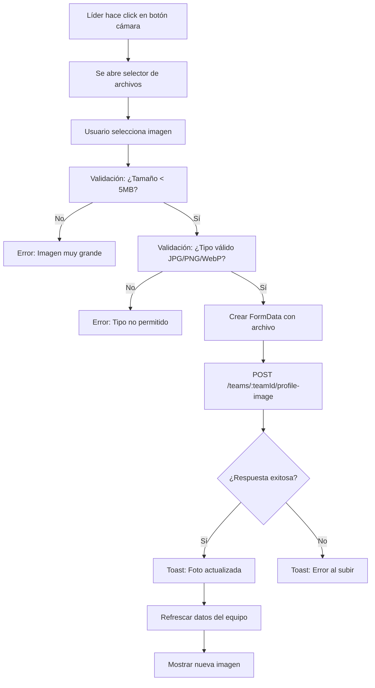

# ✅ Dashboard Miembro - Visualización de Foto del Equipo

**Fecha:** 11 de Octubre, 2025  
**Status:** ✅ Implementado correctamente

---

## 📋 Funcionalidad Implementada

### Vista del Miembro Regular

Los **miembros regulares** (rol: `ESTUDIANTE` o `MIEMBRO`) pueden:

- ✅ **Ver** la foto del equipo
- ✅ Ver información del equipo (nombre, descripción, stats)
- ✅ Ver lista de líderes
- ✅ Ver lista de otros miembros
- ❌ **NO pueden** editar la foto del equipo
- ❌ **NO pueden** cambiar nombre/descripción del equipo

### Vista del Líder

Los **líderes** (rol: `LIDER`) pueden:

- ✅ Ver la foto del equipo
- ✅ **Editar** la foto del equipo (botón de cámara visible)
- ✅ Editar nombre y descripción inline
- ✅ Ver todos los miembros
- ✅ Acceder a configuración avanzada

---

## 🔍 Implementación Técnica

### En `TeamInfo.tsx` (Dashboard Miembro)

```tsx
// Detectar si el usuario actual es líder
const currentMember = members.find((m) => m.userId === userId);
const isLeader = currentMember?.role === "LIDER";

// Avatar con permisos condicionales
<TeamAvatarWithCamera
  avatarUrl={(team as any).profileImage}
  teamName={team.name}
  size="xl"
  showCamera={isLeader}        // ← Solo líderes ven botón
  editable={isLeader}           // ← Solo líderes pueden editar
  onCameraClick={isLeader ? handleCameraClick : undefined}
  className="ring-4 ring-white/10 shadow-2xl"
/>
```

### Lógica de Permisos

```tsx
// Si es líder: muestra botón de cámara y permite click
showCamera={isLeader}       // true para LIDER, false para MIEMBRO
editable={isLeader}         // true para LIDER, false para MIEMBRO

// Si NO es líder: solo muestra la imagen sin interacción
onCameraClick={undefined}   // No hay callback para miembros regulares
```

---

## 🎨 Experiencia de Usuario

### Miembro Regular ve:

```
┌─────────────────────────────────────┐
│  [📷 Avatar del equipo]             │  ← Solo imagen
│                                     │
│  TransDigitalCoop                   │
│  Equipo de diseño web               │
│                                     │
│  [Tu rol: MIEMBRO]                  │
│                                     │
│  Stats: 3 miembros, 1 líder         │
└─────────────────────────────────────┘
```

### Líder ve:

```
┌─────────────────────────────────────┐
│  [📷 Avatar] 📸 ← Botón de cámara  │
│                                     │
│  TransDigitalCoop ✏️               │  ← Editable
│  Equipo de diseño web ✏️           │  ← Editable
│                                     │
│  [Tu rol: LÍDER]                    │
│                                     │
│  Stats: 3 miembros, 1 líder         │
└─────────────────────────────────────┘
```

---

## 📝 Código Relevante

### Archivo: `src/components/dashboard/miembro/TeamInfo.tsx`

**Líneas clave:**

```tsx
// Línea ~33: Detectar rol
const isLeader = currentMember?.role === "LIDER";

// Línea ~35-48: Handler de click (solo para líderes)
const handleCameraClick = () => {
  const input = document.createElement("input");
  input.type = "file";
  input.accept = "image/jpeg,image/png,image/webp";
  input.onchange = async (e) => {
    const file = (e.target as HTMLInputElement).files?.[0];
    if (file) {
      await handleImageUpload(file);
    }
  };
  input.click();
};

// Línea ~50-85: Upload de imagen (con validación)
const handleImageUpload = async (file: File) => {
  // Validar tamaño (máx 5MB)
  if (file.size > 5 * 1024 * 1024) {
    show({ message: "La imagen no debe superar 5MB", variant: "error" });
    return;
  }

  // Validar tipo
  if (!["image/jpeg", "image/png", "image/webp"].includes(file.type)) {
    show({ message: "Solo se permiten imágenes JPG, PNG o WebP", variant: "error" });
    return;
  }

  try {
    setUploading(true);
    const formData = new FormData();
    formData.append("file", file);
    
    await api.post(`/teams/${team.id}/profile-image`, formData);
    show({ message: "Foto del equipo actualizada", variant: "success" });
    
    if (onRefresh) onRefresh();
  } catch (error: any) {
    show({ message: error.message || "Error al subir la imagen", variant: "error" });
  } finally {
    setUploading(false);
  }
};

// Línea ~110-118: Renderizado del avatar
<TeamAvatarWithCamera
  avatarUrl={(team as any).profileImage}
  teamName={team.name}
  size="xl"
  showCamera={isLeader}       // ← Condicional
  editable={isLeader}         // ← Condicional
  onCameraClick={isLeader ? handleCameraClick : undefined}  // ← Condicional
  className="ring-4 ring-white/10 shadow-2xl"
/>
```

---

## 🧪 Testing

### Escenario 1: Usuario Regular (MIEMBRO)

1. Login como estudiante/miembro
2. Ir a `/dashboard/miembro`
3. **Verificar:**
   - ✅ Se ve la foto del equipo
   - ✅ NO hay botón de cámara
   - ✅ Hover sobre foto no muestra ningún efecto
   - ✅ Click en foto no hace nada

### Escenario 2: Usuario Líder (LIDER)

1. Login como líder
2. Ir a `/dashboard/lider`
3. **Verificar:**
   - ✅ Se ve la foto del equipo
   - ✅ HAY botón de cámara (esquina inferior derecha)
   - ✅ Hover muestra cursor pointer
   - ✅ Click abre selector de archivos
   - ✅ Subir imagen funciona
   - ✅ Toast de éxito aparece
   - ✅ Imagen se actualiza

### Escenario 3: Líder viendo su info como miembro

1. Login como líder
2. Ir a `/dashboard/miembro` (si tiene acceso)
3. **Verificar:**
   - ✅ Ve botón de cámara (porque es LIDER)
   - ✅ Puede editar foto

---

## 🔒 Seguridad

### Frontend (Actual)

```tsx
// Solo líderes ven el botón y pueden interactuar
showCamera={isLeader}
editable={isLeader}
onCameraClick={isLeader ? handler : undefined}
```

### Backend (Requerido)

**El backend DEBE verificar que el usuario es líder antes de permitir el upload:**

```javascript
// Ejemplo en Express.js
router.post('/teams/:teamId/profile-image', async (req, res) => {
  const { teamId } = req.params;
  const userId = req.user.id; // De la sesión

  // 1. Verificar que el usuario es miembro del equipo
  const member = await prisma.teamMember.findFirst({
    where: {
      teamId,
      userId,
      role: 'LIDER' // ← IMPORTANTE: Solo líderes
    }
  });

  if (!member) {
    return res.status(403).json({
      error: { message: "Solo los líderes pueden cambiar la foto del equipo" }
    });
  }

  // 2. Procesar upload
  // ...
});
```

⚠️ **CRÍTICO:** No confiar solo en el frontend. El backend debe validar permisos.

---

## 📸 Flujo de Upload (Líder)



---

## 🐛 Troubleshooting

### Problema: Miembro ve botón de cámara

**Causa:** `isLeader` está calculándose mal

**Solución:** Verificar que:
```tsx
currentMember?.role === "LIDER"  // No "LÍDER" ni "lider"
```

### Problema: Líder no ve botón de cámara

**Causa:** `isLeader` es `false` cuando debería ser `true`

**Debug:**
```tsx
console.log('Current member:', currentMember);
console.log('Is leader:', isLeader);
console.log('Role:', currentMember?.role);
```

### Problema: Foto no se actualiza después de subir

**Causa:** Falta callback `onRefresh`

**Solución:**
```tsx
// En page.tsx
<TeamInfo 
  team={team}
  members={members}
  userId={userId}
  onRefresh={loadData}  // ← Agregar esto
/>
```

---

## ✅ Checklist de Verificación

### Frontend

- [x] `isLeader` se calcula correctamente
- [x] `showCamera` usa `isLeader`
- [x] `editable` usa `isLeader`
- [x] `onCameraClick` solo para líderes
- [x] Validación de tamaño (5MB)
- [x] Validación de tipo (JPG/PNG/WebP)
- [x] FormData construido correctamente
- [x] Toast de éxito/error
- [x] Refresh después de upload
- [x] Estado de loading (uploading)

### Backend

- [ ] Endpoint POST `/teams/:teamId/profile-image` existe
- [ ] Verifica que usuario es LIDER del equipo
- [ ] Procesa multipart/form-data
- [ ] Sube a ImageKit o storage
- [ ] Actualiza `team.profileImage` en DB
- [ ] Retorna URL de la nueva imagen
- [ ] Maneja errores correctamente

### Testing

- [ ] Login como miembro → No ve botón
- [ ] Login como líder → Ve botón
- [ ] Líder puede subir foto
- [ ] Foto se muestra correctamente
- [ ] Validaciones funcionan
- [ ] Errores se muestran con toast

---

## 📊 Matriz de Permisos

| Acción | ESTUDIANTE/MIEMBRO | LIDER | EMPRESARIO | ADMIN |
|--------|-------------------|-------|------------|-------|
| Ver foto equipo | ✅ | ✅ | ❌ | ✅ |
| Editar foto equipo | ❌ | ✅ | ❌ | ✅ |
| Ver miembros | ✅ | ✅ | ❌ | ✅ |
| Editar info equipo | ❌ | ✅ | ❌ | ✅ |
| Invitar miembros | ❌ | ✅ | ❌ | ✅ |

---

**Status:** ✅ Completamente implementado en frontend  
**Pendiente:** Backend debe implementar endpoint con validación de permisos  
**Testing:** Listo para QA
