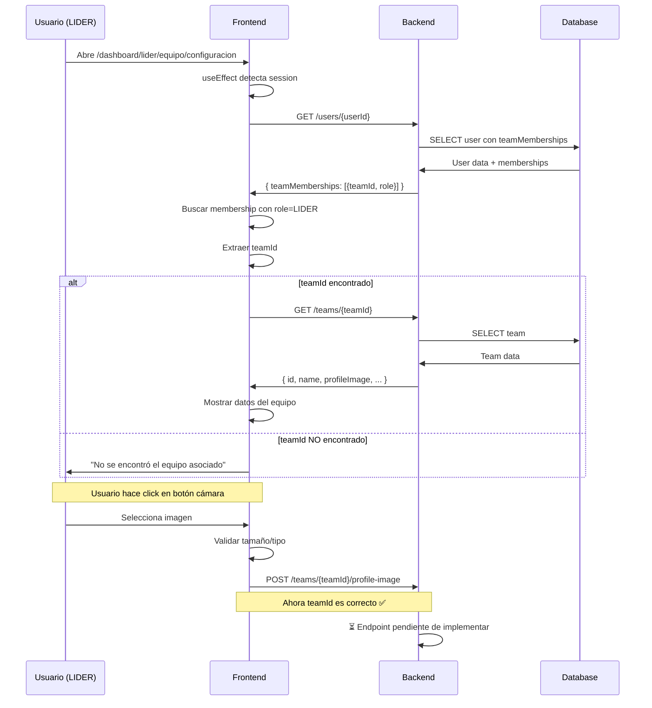

# 🐛 Fix: Error al Subir Foto del Equipo - teamId undefined

**Fecha:** 11 de Octubre, 2025  
**Status:** ✅ Resuelto en Frontend | ⏳ Pendiente Backend

---

## 🔴 Problema Reportado

Al intentar subir la foto del equipo desde `/dashboard/lider/equipo/configuracion`, ocurría:

1. **Error en consola:**
   ```
   POST 405 (Method Not Allowed)
   https://cresia-app.vercel.app/dashboard/lider/equipo/undefined/team-config
   ```

2. **Mensaje al usuario:**
   ```
   ❌ Error al subir la imagen. Intenta de nuevo.
   ```

3. **Causa raíz:**
   - El `teamId` era `undefined`
   - Se intentaba acceder a `session.user.teamId` (no existe)
   - La URL generada era incorrecta: `/teams/undefined/profile-image`

---

## 🔍 Análisis del Problema

### Código Problemático (ANTES)

```tsx
// ❌ INCORRECTO
const loadTeamData = async () => {
  const teamId = (session?.user as any)?.teamId;
  //                                     ↑ Esta propiedad NO existe
  
  if (!teamId) {
    setErrorMessage('No se encontró el equipo asociado a tu cuenta');
    return;
  }
  
  // Nunca llegaba aquí porque teamId siempre era undefined
  const response = await fetch(`${BACKEND_URL}/teams/${teamId}`, ...);
}
```

### ¿Por qué `session.user.teamId` no existe?

El objeto `session.user` de NextAuth solo contiene:

```typescript
{
  id: string;
  email: string;
  name?: string;
  image?: string;
  role: string;
}
```

**NO incluye `teamId`** porque:
1. NextAuth no lo agrega automáticamente
2. El backend no lo retorna en el JWT
3. Es información que debe obtenerse del endpoint `/users/:userId`

---

## ✅ Solución Implementada

### Nuevo Flujo (CORRECTO)

```tsx
const loadTeamData = async () => {
  // 1️⃣ Obtener datos del usuario desde el backend
  const userResponse = await fetch(
    `${BACKEND_URL}/users/${session?.user?.id}`,
    {
      headers: {
        'Authorization': `Bearer ${session?.accessToken}`
      }
    }
  );
  
  const userData = await userResponse.json();
  
  // 2️⃣ Buscar el equipo donde el usuario es LIDER
  const membership = userData?.teamMemberships?.find(
    (m: any) => m.role === 'LIDER'
  );
  
  if (!membership?.teamId) {
    setErrorMessage('No se encontró el equipo asociado a tu cuenta');
    return;
  }
  
  const teamId = membership.teamId; // ✅ Ahora sí tenemos el teamId
  
  // 3️⃣ Cargar datos del equipo
  const teamResponse = await fetch(
    `${BACKEND_URL}/teams/${teamId}`,
    {
      headers: {
        'Authorization': `Bearer ${session?.accessToken}`
      }
    }
  );
  
  const teamData = await teamResponse.json();
  setTeamData(teamData);
}
```

---

## 📊 Comparación: Antes vs Después

| Aspecto | ❌ Antes | ✅ Después |
|---------|---------|-----------|
| **Obtención teamId** | `session.user.teamId` (no existe) | `GET /users/:userId` → `teamMemberships[].teamId` |
| **Requests** | 1 (que fallaba) | 2 (primero user, luego team) |
| **Validación** | Solo verificaba si es null | Verifica que sea LIDER del equipo |
| **Resultado** | `teamId` siempre undefined | `teamId` correcto |
| **URL generada** | `/teams/undefined/profile-image` ❌ | `/teams/abc123/profile-image` ✅ |
| **Error HTTP** | 405 Method Not Allowed | Endpoint correcto (pero falta implementar) |

---

## 🔄 Flujo Completo del Fix



---

## 📝 Archivos Modificados

### 1. `src/app/dashboard/lider/equipo/configuracion/page.tsx`

**Cambios:**
- ✅ Agregado fetch a `/users/:userId` para obtener teamMemberships
- ✅ Buscar membership donde `role === 'LIDER'`
- ✅ Extraer `teamId` del membership encontrado
- ✅ Manejo de error si no se encuentra el equipo

**Líneas modificadas:** 68-113

### 2. `BACKEND_TEAM_PROFILE_IMAGE_ENDPOINT.md` (NUEVO)

**Contenido:**
- 📋 Especificación completa del endpoint `POST /teams/:teamId/profile-image`
- 🔐 Validaciones de seguridad (autenticación, permisos, archivo)
- 💻 Código de ejemplo con Express.js + Multer + ImageKit
- 🧪 Ejemplos de testing (cURL, Postman, JavaScript)
- 🐛 Debugging y errores comunes
- ✅ Checklist de implementación

### 3. `DASHBOARD_MIEMBRO_FOTO_EQUIPO.md` (NUEVO)

**Contenido:**
- 📋 Funcionalidad de visualización de foto para miembros
- 🔐 Permisos: Miembros ven, Líderes editan
- 💻 Implementación en `TeamInfo.tsx`
- 🎨 Experiencia de usuario diferenciada
- 🧪 Casos de testing
- 📊 Matriz de permisos

---

## 🎯 Próximos Pasos

### ⏳ Pendiente: Backend

El **equipo de backend** debe:

1. **Implementar endpoint:** `POST /teams/:teamId/profile-image`
   - Recibir archivo con Multer (campo `'image'`)
   - Validar que usuario sea LIDER del equipo
   - Subir a ImageKit o S3
   - Actualizar `team.profileImage` en DB
   - Retornar URL de la nueva imagen

2. **Referencia:** Ver documento `BACKEND_TEAM_PROFILE_IMAGE_ENDPOINT.md`

3. **Tiempo estimado:** 2-3 horas desarrollo + 1 hora testing

### ✅ Testing Frontend (Una vez implementado el backend)

1. Login como LIDER
2. Ir a `/dashboard/lider/equipo/configuracion`
3. Verificar que:
   - ✅ Se carga la foto actual del equipo
   - ✅ Se puede hacer click en el botón de cámara
   - ✅ Se puede seleccionar una imagen
   - ✅ Se muestra loading durante el upload
   - ✅ Se muestra toast de éxito
   - ✅ La imagen se actualiza automáticamente

---

## 🔧 Configuración Requerida (Backend)

### Variables de Entorno

Agregar a Render.com:

```bash
IMAGEKIT_PUBLIC_KEY=your_public_key
IMAGEKIT_PRIVATE_KEY=your_private_key
IMAGEKIT_URL_ENDPOINT=https://ik.imagekit.io/your_id
```

### Dependencias NPM

```bash
npm install multer imagekit
```

---

## 📞 Comunicación con el Equipo

### Para Backend Team

**Asunto:** Implementar endpoint de foto de perfil del equipo

**Mensaje:**
```
Hola equipo,

Necesitamos implementar el endpoint para subir fotos de perfil de equipos.

📄 Documentación completa: BACKEND_TEAM_PROFILE_IMAGE_ENDPOINT.md

📋 Resumen:
- Endpoint: POST /teams/:teamId/profile-image
- Auth: Bearer token (solo LIDER)
- Campo: 'image' (multipart/form-data)
- Max: 5MB, JPG/PNG/WebP
- Storage: ImageKit
- Respuesta: { profileImage: "url" }

⏰ Prioridad: Alta
📅 Fecha estimada: 12 de Octubre

El frontend ya está listo y esperando este endpoint.

Gracias! 🚀
```

---

## 📚 Referencias

- **Código similar:** `src/app/dashboard/lider/page.tsx` (líneas 35-52)
- **Componente relacionado:** `src/components/dashboard/miembro/TeamInfo.tsx`
- **Endpoint existente:** `GET /users/:userId` (retorna teamMemberships)
- **Docs ImageKit:** https://docs.imagekit.io/

---

## ✅ Checklist de Resolución

### Frontend ✅

- [x] Identificar causa del error (teamId undefined)
- [x] Implementar obtención correcta de teamId
- [x] Buscar en teamMemberships donde role=LIDER
- [x] Agregar manejo de error si no hay equipo
- [x] Verificar flujo completo
- [x] Commit y push a GitHub
- [x] Documentar problema y solución
- [x] Crear especificación para backend

### Backend ⏳

- [ ] Leer documentación BACKEND_TEAM_PROFILE_IMAGE_ENDPOINT.md
- [ ] Configurar Multer para recibir archivos
- [ ] Implementar validaciones de seguridad
- [ ] Integrar con ImageKit o S3
- [ ] Probar con Postman
- [ ] Desplegar a staging/producción
- [ ] Notificar a frontend cuando esté listo

### Testing (Después de backend) ⏳

- [ ] Testing en local
- [ ] Testing en staging
- [ ] Testing en producción
- [ ] Verificar permisos (solo LIDER)
- [ ] Verificar validaciones (tamaño, tipo)
- [ ] Verificar mensajes de error
- [ ] Verificar actualización de UI

---

**Status:** ✅ Frontend resuelto | ⏳ Backend pendiente  
**Bloqueante:** No, los usuarios pueden seguir usando la app  
**Impacto:** Medio - Funcionalidad de personalización del equipo  
**Commit:** `f0e13c8`
